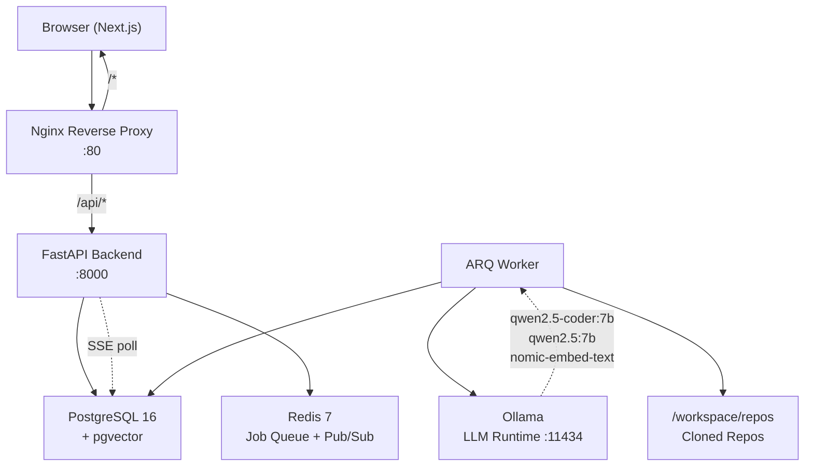
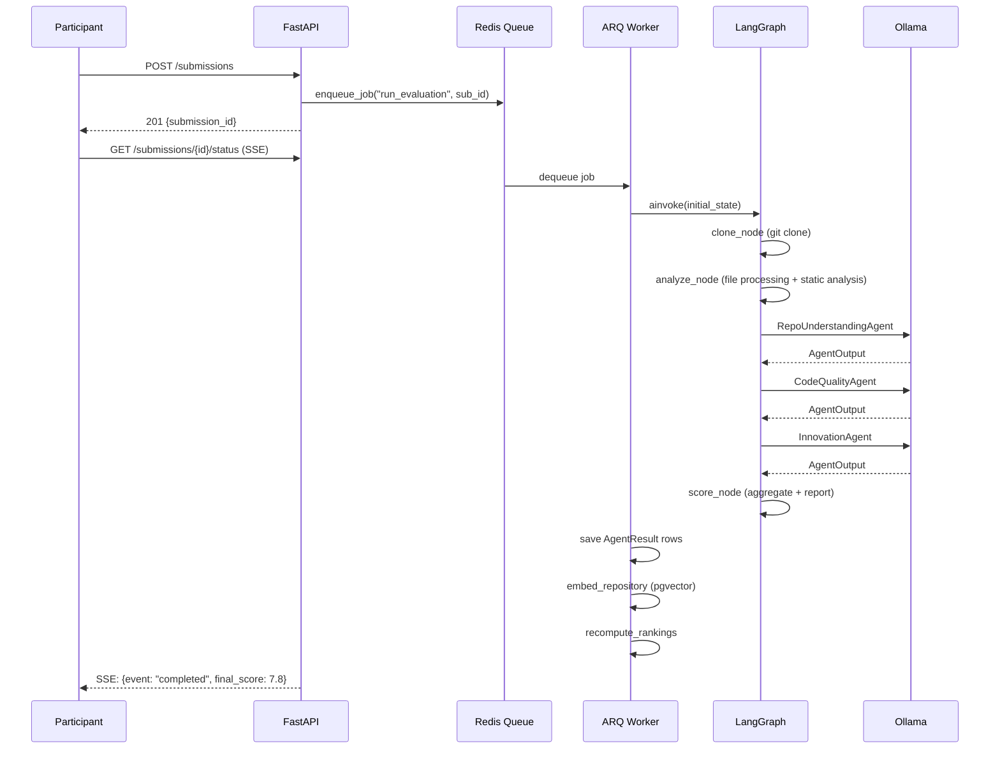

# EVALON — Architecture

This document describes the system architecture of EVALON, covering service topology, the evaluation pipeline state machine, database entity relationships, component interactions, and the key design decisions that shape the codebase.

---

## System Overview

EVALON is a multi-service application orchestrated by Docker Compose. The key architectural decision is separating request-handling (backend) from evaluation work (worker) — this lets the API remain responsive while multi-minute evaluation jobs run in background.

## Component Diagram



## Evaluation Pipeline Flow



## Database Schema

Key relationships:
- **User** → creates **Hackathon** (admin_id FK)
- **User** → submits **Submission** (one per hackathon per user)
- **Hackathon** → has **Criterion[]** (weighted evaluation dimensions)
- **Submission** → has one **Evaluation** (pipeline results)
- **Evaluation** → has **AgentResult[]** (one per agent)
- **AgentResult** → links to **Criterion** (which weight to apply)
- **Submission** → has **Ranking** (computed after evaluation)
- **Submission** → has **RepoEmbedding[]** (for RAG chatbot)
- **User** + **Submission** → **ChatSession** → **ChatMessage[]**

## Design Patterns

### Agent Pattern
Each evaluator is a subclass of `BaseAgent` with a `safe_evaluate()` wrapper that catches all exceptions and returns an `AgentOutput` with `abstained=True` rather than crashing the pipeline. This enforces Principle P3: resilience.

### Static-first Scoring (Principle P1)
AI agents receive structured tool output (radon metrics, ESLint errors, semgrep findings) and are instructed to interpret — not invent — scores. The prompt template includes explicit anti-hallucination instructions and references specific numbers from the tool output.

### SSE Streaming
The `/submissions/{id}/status` endpoint uses FastAPI's `StreamingResponse` with an async generator that polls the database every 2 seconds. No WebSocket is needed. Nginx is configured with `proxy_buffering off` to ensure events are forwarded immediately.

### RAG Mentor
The mentor chatbot uses Retrieval-Augmented Generation:
1. User message → embed with nomic-embed-text
2. pgvector cosine similarity search across submission's chunks
3. Top-4 chunks injected into LLM system prompt
4. LLM generates grounded response

## Service Descriptions

| Service | Image | Role |
|---------|-------|------|
| `nginx` | nginx:alpine | Reverse proxy; routes `/api/*` to FastAPI, all other paths to Next.js |
| `backend` | custom (./backend) | FastAPI application server; REST API, SSE streams, auth, business logic |
| `worker` | custom (./backend) | Separate process running `arq WorkerSettings`; consumes evaluation jobs |
| `postgres` | pgvector/pgvector:pg16 | Primary relational database with pgvector for 768-dim vector columns |
| `redis` | redis:7-alpine | ARQ job queue broker and result store |
| `ollama` | ollama/ollama:latest | Local LLM inference; serves language models and the embedding model |
| `frontend` | custom (./frontend) | Next.js 14 application serving participant and admin UIs |

The `backend` and `worker` containers share the same Docker image but run different commands. Both mount the same `workspace` volume for access to cloned repositories during evaluation.

## Pipeline State Machine

The pipeline state is tracked via the `EvaluationState` TypedDict passed through the LangGraph graph. The `should_continue` conditional router checks `state["status"]` after each node:

| After node | status value | Next node |
|-----------|-------------|-----------|
| clone | `analyzing` | analyze |
| clone | `failed` | END |
| analyze | `evaluating` | evaluate |
| analyze | `failed` | END |
| evaluate | `scoring` | score |
| evaluate | `failed` | END |
| score | (any) | END |

## Agent Execution

All three agents run sequentially in the evaluate node (not in parallel, to avoid saturating Ollama):

1. **RepoUnderstandingAgent** — `qwen2.5:7b` at temperature 0.1; evaluates structure, documentation quality, README completeness, project clarity
2. **CodeQualityAgent** — `qwen2.5-coder:7b` at temperature 0.1; receives 3–5 code samples; evaluates complexity, style, test presence, best practices
3. **InnovationAgent** — `qwen2.5:7b` at temperature 0.3; evaluates novelty, creativity, theme alignment with calibration anchor

Each agent uses a Jinja2 template from `backend/app/agents/prompts/` to construct its prompt, calls `OllamaProvider.generate()`, then parses the JSON response into an `AgentOutput` dataclass. If JSON parsing fails, the agent sets `abstained=True` rather than crashing the pipeline.

## Scoring and Aggregation

The `aggregate_scores()` function in `backend/app/scoring/aggregator.py`:

1. Loads per-hackathon criteria weights from the database (mapped by `agent_id`)
2. Falls back to default weights (`repo_understanding: 0.30, code_quality: 0.40, innovation: 0.30`) if no criteria are defined
3. Normalizes weights to sum to 1.0
4. Excludes abstained agents and renormalizes the remaining weights
5. Returns a final score in the range [0.0, 10.0] rounded to three decimal places

After scoring, `recompute_rankings()` re-sorts all completed evaluations for the hackathon by `final_score` descending and upserts `Ranking` rows with `rank`, `normalized_score` (0–10 min-max scaled), and `percentile`.

## API Surface

All routes are mounted under `/api/v1/`:

| Prefix | Resource | Key endpoints |
|--------|----------|--------------|
| `/auth` | Authentication | `POST /login`, `POST /register`, `POST /refresh` |
| `/hackathons` | Hackathon management | CRUD + participant management |
| `/submissions` | Submission lifecycle | `POST /`, `GET /{id}`, `GET /{id}/status` (SSE), `DELETE /{id}` |
| `/evaluations` | Evaluation results | `GET /{id}`, `GET /{id}/agents` |
| `/rankings` | Leaderboard | `GET /hackathon/{id}` |
| `/chat` | Mentor chatbot | `POST /sessions`, `POST /sessions/{id}/messages` |
| `/admin` | Admin operations | Hackathon finalization, user management |

## Technology Choices

See [RESEARCH.md](RESEARCH.md) for detailed comparison tables. Summary:

| Decision | Choice | Key Reason |
|----------|--------|-----------|
| Backend framework | FastAPI | Native async, Pydantic v2, SSE support |
| Database | PostgreSQL + pgvector | Single store for relational + vector data |
| Job queue | ARQ + Redis | Pure async Python, no monkey-patching |
| AI orchestration | LangGraph | Conditional edges for resilient agent failure |
| LLM runtime | Ollama | Fully local, no API keys required |
| Vector search | pgvector | Avoids 4th infrastructure service |

For detailed rationale on each choice, see:
- [ADR-001: FastAPI for backend framework](docs/decisions/ADR-001-framework-choice.md)
- [ADR-002: PostgreSQL + pgvector for storage](docs/decisions/ADR-002-database-choice.md)
- [ADR-003: LangGraph for AI orchestration](docs/decisions/ADR-003-ai-orchestration.md)
- [ADR-004: ARQ + Redis for job queue](docs/decisions/ADR-004-queue-system.md)
- [ADR-005: Static-analysis-grounded AI evaluation strategy](docs/decisions/ADR-005-evaluation-strategy.md)

---

## Database Entity Relationship (Detail)

```
users
  ├── hackathons (admin_id → users.id)
  │     ├── criteria (hackathon_id → hackathons.id)
  │     ├── submissions (hackathon_id → hackathons.id)
  │     │     ├── evaluations (submission_id → submissions.id) [unique]
  │     │     │     └── agent_results (evaluation_id → evaluations.id)
  │     │     ├── rankings (submission_id → submissions.id)
  │     │     ├── repo_embeddings (submission_id → submissions.id)
  │     │     └── chat_sessions (submission_id → submissions.id)
  │     │           └── chat_messages (session_id → chat_sessions.id)
  │     └── hackathon_participants (hackathon_id + user_id) [unique pair]
  └── submissions (user_id → users.id)
```

### Key Column Notes

- **`evaluations.report`** — JSONB storing the full report: `final_score`, `grade`, `top_strengths`, `top_weaknesses`, per-agent narrative summaries
- **`evaluations.model_versions`** — JSONB dict recording which model version served each agent, for auditability across model upgrades
- **`agent_results.evidence`** — JSONB array of `{file, observation}` dicts citing specific files in the submitted repository
- **`repo_embeddings.embedding`** — `vector(768)` column; HNSW index (`vector_cosine_ops`) for efficient approximate KNN
- **`hackathons.settings`** — JSONB with keys: `allow_private_repos`, `max_repo_size_mb`, `evaluation_mode`, `show_rankings_before_finalization`
- **`submissions`** — unique constraint on `(hackathon_id, user_id)` prevents duplicate submissions per user per hackathon

---

## Component Interaction Details

### How SSE Works End-to-End

1. Client opens `EventSource` to `GET /submissions/{id}/status`
2. FastAPI returns a `StreamingResponse(media_type="text/event-stream")` with `X-Accel-Buffering: no`
3. Nginx forwards the stream without buffering (`proxy_buffering off`)
4. The async generator in the endpoint polls `SELECT status FROM submissions WHERE id=$1` every 2 seconds
5. On each status change, a JSON event is yielded: `data: {"event": "progress", "data": {...}}\n\n`
6. On `completed` status, the generator fetches the `Evaluation` record and yields a `completed` event with `final_score`
7. The client-side `useEvaluationStream` hook receives these events via `eventSource.onmessage`, updates React state, and calls `onComplete(evaluation)` after the final event

### How the ARQ Worker Discovers Jobs

1. Worker process starts: `python -m arq app.jobs.worker.WorkerSettings`
2. ARQ polls Redis key `arq:queue` in a tight async loop using `BRPOP` with a configurable timeout
3. When a job is found, ARQ deserializes the function name (`run_evaluation`) and arguments (`submission_id`)
4. ARQ calls `await run_evaluation(ctx, submission_id)` in the worker's asyncio event loop
5. If the task raises an unhandled exception, ARQ marks the job as failed (retries up to `max_tries` if configured)
6. Job result (or exception) is stored in `arq:result:{job_id}` with the configured `keep_result` TTL

### How Rankings Are Updated Live

After every successful evaluation, the ARQ task calls `recompute_rankings(db, hackathon_id)` which:
1. Queries all `evaluations` with `status=completed` and `final_score IS NOT NULL` for the hackathon
2. Sorts by `final_score` descending
3. Computes `normalized_score = (score - min) / (max - min) * 10` and `percentile`
4. Upserts `Ranking` rows (one per submission) with `rank`, `normalized_score`, `percentile`

This means rankings are always live and consistent — no separate ranking job is needed. The `show_rankings_before_finalization` hackathon setting controls whether the rankings API returns data to participants before the admin finalizes.
